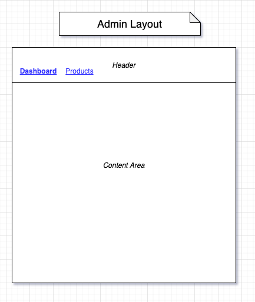
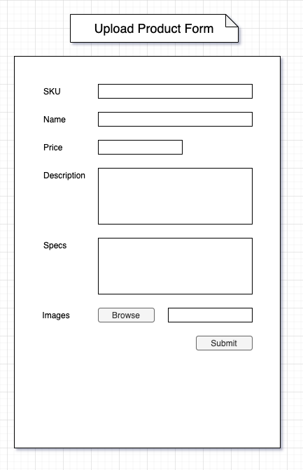
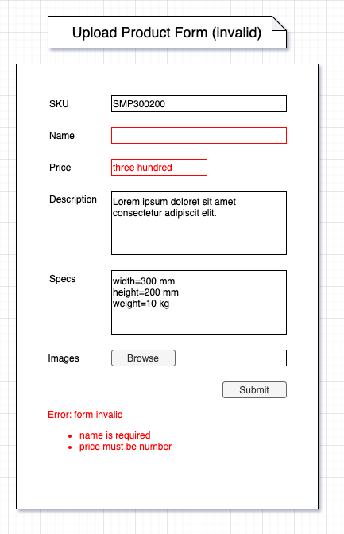
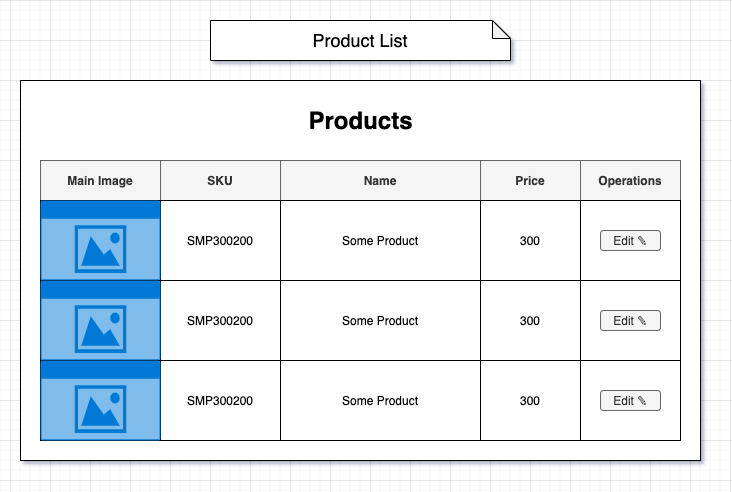
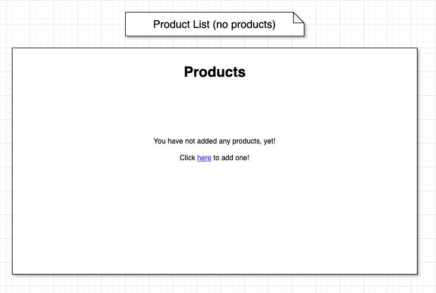
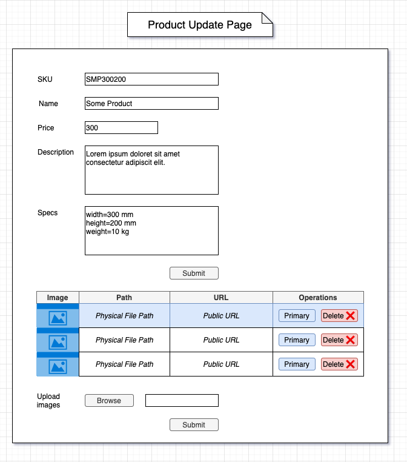
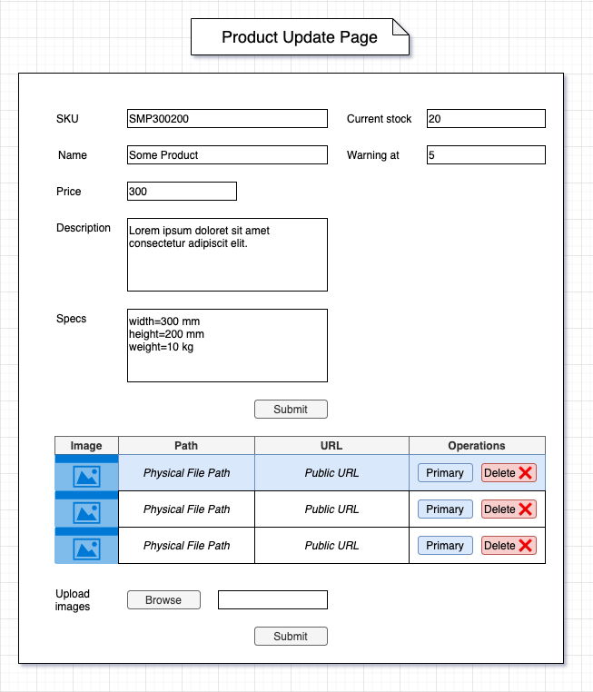
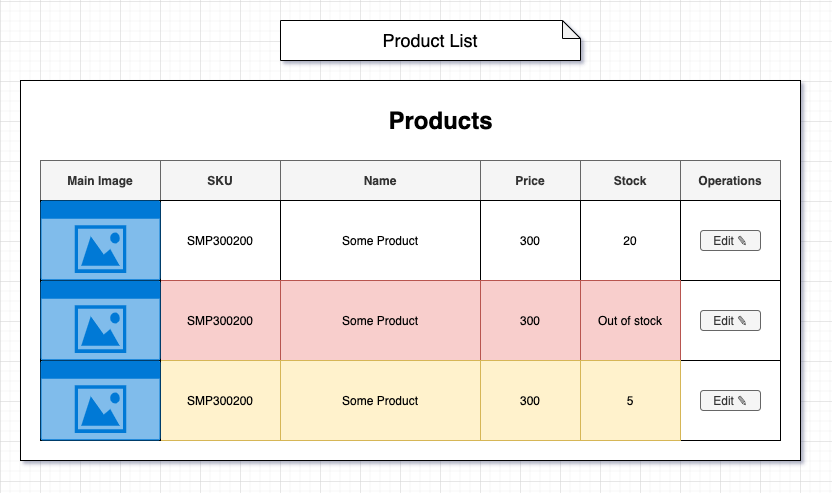

# 1. Admin Skeleton

## 1.1 Header & Routing (`skeleton`)

Fektessük le a projekt alapjait. Az általános elrendezés az
Admin Layout:
- a fejléc (Header) alatt
- a Content Area jelzi a képernyő tartalmának helyét

A Headerben két navigációs link van:
- a Dashboard képernyő az alkalmazás kezdőképernyője
- A Products képernyő a termékeket kezelő CRUD funkciók
  belépési pontja

Az aktuális képernyőhöz tartozó link ki van emelve (pl.
félkövér vagy eltérő színű).

Minden képernyő, hacsak más nincs mondva, ezt az
 elrendezést és keretet használja!

# 2. Product CRUD

## 2. 1 Product Upload (`product-upload`)

### Product Upload Page

Jelenjen meg egy `UploadProductForm` komponens a `/upload-product` útvonalon.

Az űrlap elemei:
- SKU (stock keeping unit): text input, a termék leltári azonosítója, alfanumerikus érték, maximum 12 karakter hosszú
- Name: text input, a termék megnevezése, kötelező
- Price: number input, a termék ára, kötelező
- Description: textarea, a termék leírása, legfeljebb 240 karakter
- Specs: textarea, a termék műszaki adatai, egy sorban
  egy adat, `=` karakterrel elválasztva, pl `clock=3GHz`, legalább egy jellemző kötelező
- Images: multiple file input, a termékhez tartozó képek

A hibaüzenetek (validációs-, hálózati- vagy szerverhiba)
az űrlap alatt jelennek meg.

### Product Upload Backend

Legyen egy `POST /product` endpoint, amely a Product Upload Form adatait fogadja.

Sikeres termék feltöltés esetén a Dashboard képernyőre
irányítson át, hiba esetén az `/upload-product` útvonalra.

A hiba jellegét query paraméterként kódoljuk, pl `/upload-product?err=sku_gen`.

Ügyeljünk a hibakezelésre, a szerver lehetőleg semmilyen hiba esetén se álljon le.

Ha a requestben nincs SKU, generáljunk egyet. A generálás
menete:
- legyen a requestben érkező termék neve `MacBook Pro 2019 16"`
- vegyük a 'szavak' kezdő betűit (egy 'szó' egy szóközzel elválasztott része a teljes stringnek): `M`, `P`, `2`, `1`
- Ha van speciális, nem alfanumerikus karakter, azt hagyjuk el: jelenleg nincs
- az összefűzött karak terlánc lesz a generált SKU: `MP21`
- ha már létezik termék a megadott leltári azonosítóval,
  dobjunk hibát

Ha több képet töltöttünk fel, az első kép legyen az Elsődleges Kép (Primary Image). Mindenütt a Primary Image jelenik meg
 alapértelmezetten a termék vonatkozásában.

A képeket úgy tároljuk el a merevlemezen, hogy később
bármikor vissza tudjuk olvasni önállóan is és egy adott
 termékhez kapcsolódóan is az összes képet!

#### Fájlok feldolgozása Formidable segítségével

Használjuk a Formidable könyvtárat a fájlok feldolgozására:
https://www.npmjs.com/package/formidable

## 2.2 Product List (`product-list`)

### Product List Page

A /products útvonalon jelenítsük meg a feltöltött termékeket. Minden termék sorában egy Edit gomb van,
amely a terméket szerkesztő képernyőre vezet.

Ha nincs megjelenítendő termék, egy üzenet jelenjen meg
egy linkkel a termék feltöltő képernyőre.

### Poduct List Backend

Legyen egy `GET /products` endpoint, amely az adatbázisban
tárolt termékek adatait szolgálja ki.

## 2.3 Update Product (`update-product`)

### Product Update Page

Legyen egy `/product/:sku` útvonal, amely egy űrlapot
és egy táblázatot jelenít meg.

Az űrlap lényegében ugyanaz az űrlap, mint a termék feltöltés
esetén, a következő kivételekkel:
- az SKU nem szerkeszthető
- a képfeltöltés önálló form, és a feltöltött képek hozzáadódnak a termékhez

Az űrlap előre ki van töltve a termék adataival.

Az űrlap alatt a feltöltött képek jelennek meg. Minden képhez
két gomb tartozik:
- primary: a kiválasztott kép lesz az elsődleges kép
- delete: törli a képet

Ha nincs feltöltött kép vagy mindet töröltük, egy szöveget
jelenítünk meg a táblázat helyén, ami tájékoztat, hogy
nincs feltöltött kép.

Egy kép publikus URL-je az az URL, ahol a kép elérhető
böngészőből, pl. `http://localhost:3000/images/mbp201916inch.jpg`. Egy kép fizikai útvonala a szervert futtató gépen
található helye a merevlemezen.

Az elsődleges kép ki van emelve a táblázatban.

A táblázat gombjai AJAXszal működnek, a táblázat alatti file input
csak az új képek hozzáadására szolgál!

### Product Update Backend

Legyen egy `GET /products/:sku/files` endpoint, amely egy adott
termék adatait adja vissza

Legyen egy `PUT /poducts/:sku` endpoint, amely egy adott termék
adatait írja felül a beérkező adatokkal

Legyen egy `POST /products/:sku/files/` endpoint, amely egy adott
termékhez tölt fel új képet

Legyen egy `PUT /files/:id` endpoint, amely egy adott fájl
adatait írja felül. Ezzel az endpointtal tudunk egy képet elsődlegessé
tenni.

Legyen egy `DELETE /files/:id` endpoint, amellyel egy adott képet
tudunk törölni.

**Figyeljünk az alábbi esetekre**
- Egyszerre csak egy primary kép lehet!
- Mi történik, ha kitörlünk egy primary képet?

## 2.4 Delete Product (`delete-product`)

### Delete Product Flow

Legyen egy `Delete Product` gomb az UpdateProduct képernyőn. A gombra kattintva
jelenjen meg egy modal ablak, amelyben megerősíthetjük a törlési szándékunkat.

### Delete Product Backend

Legyen egy `DELETE /product/:sku` endpoint, amely fogadja a termék törlésére
vonatkozó kérést. A terméket és az összes termékhez kapcsolódó fájlt is töröljük,
mind az adatbázisból, mind a fájlrendszerről!

# Inventory management

## Készlet megadása (`stock-management`)

Egészítsük ki az Update Product képernyőn az űrlapot két mezővel:
- Current stock: szám, az aktuális készlet
- Warning at: szám, egy határérték, amely alatt jelez a rendszer, hogy az áru fogyóban van

Mindkét szám 0 vagy pozitív szám lehet.

## Készlet kijelzése (`show-stocks`)

Egészítsük ki a Product List képernyőt egy készletet jelző oszloppal.

Ha a készlet a megadott határérték alatt van, a termék sora
legyen sárgás árnyalatú. Ha a termék kifogyott, legyen piros
árnyalatú. Ha a határértéket nullára állítottk be, az azt
jelenti, hogy nincs figyelmeztetés, a termék piros lesz, amint
kifogyott.

